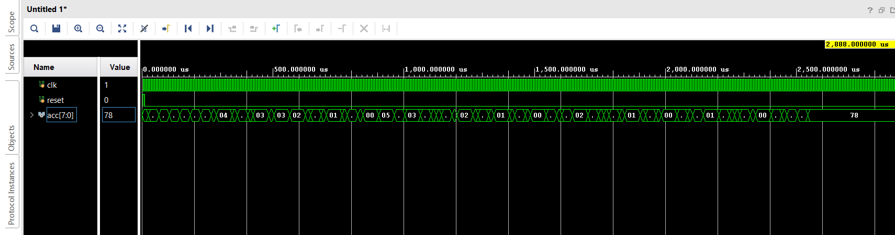

# LIPSI Processor

## Description

Lipsi is an 8-bit processor architecture which can be used to perform basic operations like finding sum of ‘n’ natural numbers, sum of squares of ‘n’ natural numbers, finding factorials and other similar operations using custom 8 bit instructions.
 
The processor is designed using Verilog HDL & can be implemented on Artix-7 FPGA (On Basys3 board) using Vivado Design Suite or on any other FPGA available. 

## Architecture Overview

The architecture includes the following major components:

- **Program Counter (PC):** Tracks the current instruction address.
- **Memory:** Consists of data memory which stores data values and instruction memory which stores instruction inputs(Von Neumann architecture)
- **ALU (Arithmetic Logic Unit):** Performs arithmetic and logical operations.
- **Accumulator:** Stores the current value or the value got from ALU operation.
- **Control Unit:** Decodes instructions and generates control signals.

## LIPSI instruction set with encoding

| Encoding         | Instruction | Meaning                      | Operation          |
|------------------|-------------|-------------------------------|--------------------|
| 0fff rrrr        | f rx        | ALU register                  | A = A f m[r]       |
| 1000 rrrr        | st rx       | store A into register         | m[r] = A           |
| 1001 rrrr        | brl rx      | branch and link               | m[r] = PC, PC = A  |
| 1010 rrrr        | ldind (rx)  | load indirect                 | A = m[m[r]]        |
| 1011 rrrr        | stind (rx)  | store indirect                | m[m[r]] = A        |
| 1100 -fff nnnn nnnn | f i n     | ALU immediate                 | A = A f n          |
| 1101 --00 aaaa aaaa | br        | branch                        | PC = a             |
| 1101 --10 aaaa aaaa | brz       | branch if A is zero           | PC = a             |
| 1101 --11 aaaa aaaa | brnz      | branch if A is not zero       | PC = a             |
| 1110 --ff         | sh         | ALU shift                     | A = shift(A)       |
| 1111 1111         | exit       | exit for the tester           | PC = PC            |

### ALU operation and encoding

| Encoding | Name | Operation     |
|----------|------|---------------|
| 1000      | add  | A = A + op    |
| 1001      | sub  | A = A − op    |
| 1010      | adc  | A = A + op + c|
| 1011      | sbb  | A = A − op − c|
| 1100      | and  | A = A ∧ op    |
| 1101      | or   | A = A ∨ op    |
| 1110      | xor  | A = A ⊕ op   |
| 1111      | ld   | A =   op      |
| 0100      | logical shift left   | A =  A << op        |
| 0101      | logical shift right   | A =  A >> op        |
| 0110      | arithmetic shift left   | A =  A <<< op        |
| 0111      | arithmetic shift right   | A =  A >>> op        |


## Module Description

The top-level module has the following inputs and outputs:

| **Signal Name**      | **Direction** | **Description**                                                      |
|-----------------------|---------------|----------------------------------------------------------------------|
| **clk**              | Input         | Clock input for the processor.                                          |
| **reset**            | Input         | Reset signal for resetting the module.                              |
| **acc**              | Output        | Value of the accumulator of the processor                            |
| **seg_ctrl**         | Output        | Value of the control signals to be given to the 7 segment display for digit selection    |
| **seg_led**          | Output        | Value of the control signals to be given to the 7 segment display for segment selection  |


---


## Installation and Setup instructions to implement the LIPSI processor on Artix-7 FPGA (On Basys3 board)

### Prerequisite
Before running the project, ensure you have Vivado Design Suite installed and configured properly.

### Cloning the Repository
Clone the repository using Git:
   ```bash
   git clone https://github.com/SandeepK2023/lipsi_processor.git
   ```
### Running the Project

- Open Vivado Design Suite, then click File --> Project --> New.
- Then give the name of the project and then choose RTL project in the next window and click Next.
- In the Add sources window, add all the Verilog code files (.v extension files) from the cloned files. Click Next.
- In Add constraints window, add the constraints file (.xdc extension file). Click Next.
- In Default Part window, choose Basys3 Board and click Next and then Finish.
- This will create a new project for implementation of the Verilog codes for LIPSI processor.
- Then run synthesis, implementation of the code in Vivado Design Suite. Once the synthesis and implementation runs are completed, you can generate bitstream. Once bitstream is generated successfully, connect laptop to Basys3 Board using micro-USB cable and program the device. 
- The output of the instructions will be visible on the 7-segment display in hexadecimal format.


## Simulation output
### For finding factorial of 5



## Customization

- To implement on another FPGA by AMD, you might have to change the constraints file appropriately to map outputs and inputs correctly with the top module of the project (lipsi_processor.v). To implement on another FPGA by a different company, you must use the company specific software for implementing the Verilog codes. For example, for Intel FPGAs, you have to use Quartus Prime for implementing the Verilog codes on FPGA. Feel free to use the Verilog code files and implement the LIPSI processor on whichever FPGA is available with you! You can also simulate the verilog codes on advanced simulation softwares like QuestaSim to understand the working of the 8-bit processor.

- The present instructions to processor are for finding factorial of 5. You can change the instructions to modify the process you want to do by changing the initialisation of instruction memory in memory.v  file. 
- For example, for finding the sum of first 10 numbers, the memory should be initialised as


    memo[9'd256] = 8'b11000111; <br>
    memo[9'd257] = 8'd00001010; <br>
    memo[9'd258] = 8'b10000001; <br>
    memo[9'd259] = 8'b10000010; <br>
    memo[9'd260] = 8'b11000001; <br>
    memo[9'd261] = 8'b00000001; <br>
    memo[9'd262] = 8'b10000001; <br>
    memo[9'd263] = 8'b00000010; <br>
    memo[9'd264] = 8'b10000010; <br>
    memo[9'd265] = 8'b01110001; <br>
    memo[9'd266] = 8'b11010011; <br>
    memo[9'd267] = 8'b00000100; <br>
    memo[9'd268] = 8'b01110010; <br>
    memo[9'd269] = 8'b11111111;

You can modify the codes and instructions to meet your requirements!

## References

The LIPSI processor designed is adapted from the following github repository:
https://github.com/schoeberl/lipsi
